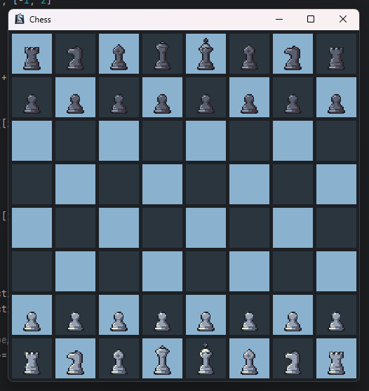
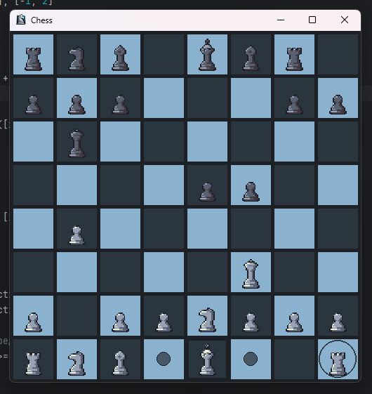

<h1 align="center">A chess game</h1>

We are doing a project in which we have to write a chess game on python.

<h2>Plan:</h2>
<h3>First, we need to learn pygame to visualize our game.</h3>

<h4>We will make some tasks to learn pygame faster:</h4>
<ol>
    <li>Create a square that will always be three times smaller than the height of the window and will always move from right to left.</li>
    <li>make this square a picture.</li>
    <li>Make several squares that will simulate a chessboard.</li>
    <li>Draw chess figures.</li>
</ol>
<h3>Then, we need to write some logic:</h3>
<ol>
    <li>Create a function, which will return a list of all possible moves depending on the position of all the figures and the figure itself.</li>
    <li>Allow users to set a figure were he wants.</li>
</ol>
<h3>If we'll have time, come up with some features.</h3>

<h4>Usefull links:</h4>
<ul>
    <li><a href="https://younglinux.info/pygame/draw">Pygame draw</a></li>
    <li><a href="https://www.pixilart.com/draw?ref=home-page#">Pixelart</a> (to go to the website you should use VPN)</li>
</ul>

<h4>Possible moves turn red, which indicates the danger of the king.</h4>

<h4>Castling is possible.</h4>

